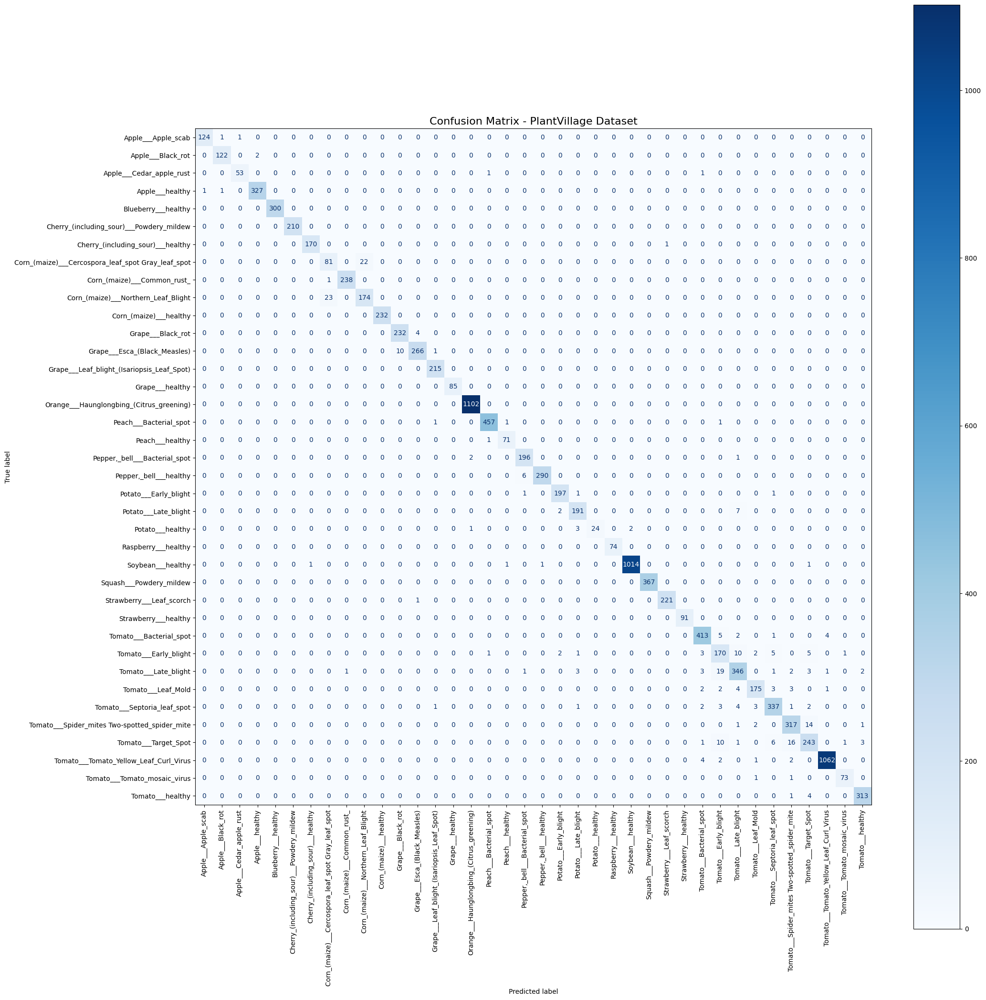

# Plant Leaf Disease Detection using ResNet50, PCA, and SVM 🍃
Reproducing a hybrid deep learning model for plant leaf disease detection on the PlantVillage dataset.

## 📌 Project Overview
This repository contains a complete, single-notebook reproduction of the research paper: **"A hybrid deep learning model for robust and efficient plant leaf disease detection using ResNet50, PCA, and SVM"**. 

The project aims to classify plant leaf diseases across **38 different classes** using the publicly available **PlantVillage dataset** (approx. 54k images).

## 🚀 Methodology Pipeline
Our end-to-end machine learning pipeline consists of:
1. **Data Preprocessing:** Resizing (224x224) and Normalizing images.
2. **Feature Extraction:** Using a pre-trained **ResNet50** (with classification layer removed) to extract high-level semantic features (2048 dimensions).
3. **Dimensionality Reduction:** Applying **Principal Component Analysis (PCA)** to reduce the feature vectors to 256 components, reducing computational cost and preventing overfitting.
4. **Classification:** Training a **Linear Support Vector Machine (SVM)** on the reduced features.

## 📊 Results & Performance
The reproduced model demonstrated exceptional stability and outperformed the baseline mentioned in the original paper, achieving highly robust metrics during evaluation:

- **5-Fold Cross-Validation Accuracy:** `97.36% (± 0.0029)`
- **Final Test Accuracy:** `97.35%`
- **Precision:** `97.37%`
- **Recall:** `97.35%`
- **F1-Score:** `97.35%`

### Confusion Matrix

  

## 💻 How to Run
Everything is contained within a single, easy-to-follow Jupyter Notebook. 

1. Open `r_hybrid__.ipynb` in Google Colab.
2. Upload your `kaggle.json` to directly download the dataset.
3. Run the cells sequentially. The notebook includes automated saving of extracted features to Google Drive to prevent data loss upon runtime disconnection.

## 📄 References
- Original Paper: **[A hybrid deep learning model for robust and efficient plant leaf disease detection using ResNet50, PCA, and SVM]([https://link-to-the-paper](https://www.nature.com/articles/s41598-026-46085-w))**
- Authors: Saba Begum, Naresh E, Srinidhi N. N.
- Dataset: [PlantVillage Dataset on Kaggle](https://www.kaggle.com/datasets/abdallahalidev/plantvillage-dataset)
